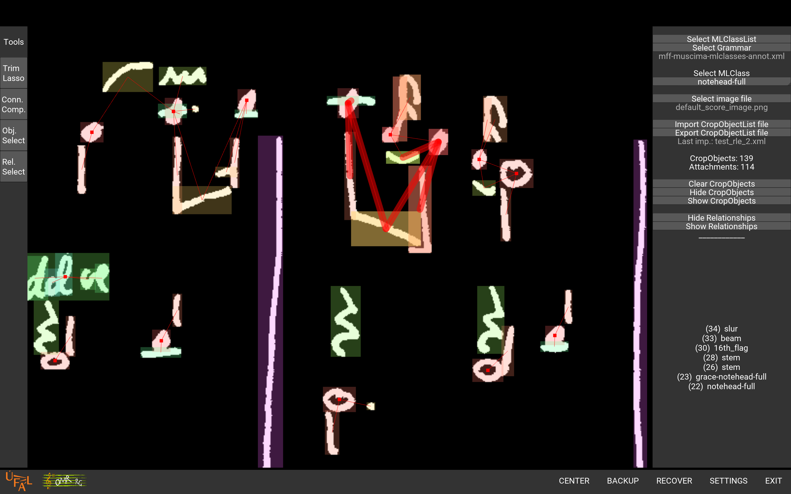

# MUSCIMA++

MUSCIMA++ is a dataset of handwritten music notation for musical symbol detection. It contains 91255 symbols, consisting of both notation primitives and higher-level notation objects, such as key signatures or time signatures. There are 23352 notes in the dataset, of which 21356 have a full notehead, 1648 have an empty notehead, and 348 are grace notes. For each annotated object in an image, we provide both the bounding box, and a pixel mask that defines exactly which pixels within the bounding box belong to the given object. Composite constructions, such as notes, are captured through explicitly annotated relationships of the notation primitives (noteheads, stems, beams...), thus forming the MUSCIMA++ Notation Graph, or MuNG. This way, the annotation provides an explicit bridge between the low-level and high-level symbols described in Optical Music Recognition literature.

MUSCIMA++ has annotations for 140 images from the CVC-MUSCIMA dataset [2], used for handwritten music notation writer identification and staff removal. CVC-MUSCIMA consists of 1000 binary images: 20 pages of music were each re-written by 50 musicians, binarized, and staves were removed. We had 7 different annotators marking musical symbols: each annotator marked one of each 20 CVC-MUSCIMA pages, with the writers selected so that the 140 images cover 2-3 images from each of the 50 CVC-MUSCIMA writers. This setup ensures maximal variability of handwriting, given the limitations in annotation resources.

The MUSCIMA++ dataset is intended for musical symbol detection and classification, and for music notation reconstruction. A thorough description of its design is published on [arXiv](https://arxiv.org/abs/1703.04824). The full definition of MuNG, the ground truth format, is given in the form of [annotator instructions](https://muscimarker.readthedocs.io/en/develop/instructions.html).

## Tools
Apart from the symbol annotation data themselves, we also provide two Python packages:

- `muscima`, which is basically an I/O interface to the v1.0 dataset (also available through pip install muscima)
- [`mung`](https://github.com/OMR-Research/mung), which is the same as `muscima` but for v2.0+
- `MUSCIMarker`, which is the annotation tool used to create the dataset.

We believe the functionality in `muscima` will make it easier for you to use the dataset. You don’t need MUSCIMarker unless you want to extend the dataset, although it is also nifty for visualization. If you do not want to use the Python interface, you can of course make your own: the data is stored as a regular XML file, described in detail in the README (and also in the `muscima.io` module).

# First Steps 

- Download the latest version [here](http://hdl.handle.net/11372/LRT-2372).
- Install the [mung](https://mung.readthedocs.io/) package.
- Follow the musicma package [tutorial](https://muscima.readthedocs.io/en/latest/Tutorial.html).

To understand how to leverage the dataset for your particular use case, you will need to familiarize yourself with how the MuNG ground truth is defined in detail. To this end, see the [annotation instructions](https://muscimarker.readthedocs.io/en/develop/instructions.html) as a reference guide. If you want to look at the notation graph, you can use the [MUSCIMarker](https://muscimarker.readthedocs.io/en/develop/) GUI app.

## Getting the CVC-MUSCIMA Images
As a part of the agreement that enabled us to release MUSCIMA++ under a permissive license, we do not distribute the underlying CVC-MUSCIMA images themselves, only the annotations. To get these underlying images, you will need to download the [CVC-MUSCIMA](http://www.cvc.uab.es/cvcmuscima/index_database.html) staff removal dataset.

Then, use the get_images_from_muscima.py script from the muscima package, using -i `cat specifications/cvc-muscima-image-list.txt`, and specify data/images as the target directory. This will extract the 140 annotated symbol images for which there are annotations, with the correct filenames.

For convenience reasons, the [`omrdatasettools`](https://omr-datasets.readthedocs.io/en/latest/index.html) package contains a [simple script](https://omr-datasets.readthedocs.io/en/latest/downloaders/MuscimaPlusPlusDatasetDownloader.html) to download the MUSCIMA++ dataset and the images.

# Ground Truth Definition

We annotated notation primitives (noteheads, stems, beams, barlines), 
as well as higher-level, “semantic” objects (key signatures, voltas, 
measure separators). For each annotated object in an image, we provide 
both the bounding box, and a pixel mask that defines exactly which pixels 
within the bounding box belong to the given object.

In addition to the objects, we annotate their relationships. The relationships
are oriented edges that generally encode attachment: a stem is attached 
to a notehead, a sharp is attached to a key signature, or a barline is attached
to a repeat sign.

We purposefully did not annotate notes, as what constitutes a note on paper 
is not well-defined, and what is traditionally considered a “note” graphical 
object does not map well onto the musical concept of a “note” with a pitch, 
duration, amplitude, and timbre. Instead of defining graphical note objects, 
we define relationships between notation primitives, so that the musical notes 
can be deterministically reconstructed. Notehead primitives (noteheadFull, 
notehead-empty, and their grace note counterparts) should provide a 1:1 interface 
to major notation semantics representations such as MusicXML or MEI.

Formally, the annotation is a directed graph of notation objects, each of which 
is associated with a subset of foreground pixels in the annotated image. We do 
our best to keep this graph acyclic.

The full definition the MUSCIMA++ ground truth (current version 0.9) is captured 
in the [annotation guidelines](http://muscimarker.readthedocs.io/en/develop/instructions.html).

## Dataset directory structure

The dataset package has the following structure:

    muscima-pp
    |
    +--+ v1.0/
    |  |
    |  +--+ data/                               ... Contains the data files.
    |  |  +--+ cropobjects_manual/              ... Contains the annotation files without automatically
    |  |  |                                         extracted staff objects and their relationships.
    |  |  +--+ cropobjects_withstaff/           ... Contains the annotation files enriched by staff objects,
    |  |  |                                         inferred automatically from CVC-MUSCIMA staff-only images
    |  |  |                                         using scripts from the ``muscima’’ package.
    |  |  |  +-- CVC-MUSCIMA_W-01_N-10_D-ideal.xml
    |  |  |  +...
    |  |  |
    |  |  +--+ images/                          ... Put corresponding CVC-MUSCIMA image files here.
    |  |                                            (Analogously, use e.g. data/fulls/ for full images.)
    |  |
    |  +--+ specifications/                             ... Contains the ground truth definition files for MUSCIMarker:
    |  |  +-- cvc-muscima-image-list.txt               ... list of CVC-MUSCIMA images used for annotation,
    |  |  +-- mff-muscima-mlclasses-annot.xml          ... list of object classes,
    |  |  +-- mff-muscima-mlclasses-annot.deprules     ... and list of rules governing their relationships.
    |  |  +-- testset-dependent.txt                    ... List of writer-dependent test set images. 
    |  |  |                                                 (Same handwriting in training and test set.)
    |  |  +-- testset-independent.txt                  ... List of writer-dependent test set images.
    |  |                                                    (Test set handwriting never seen in training set.)
    +--+ v2.0/
    |  |
    |  +--+ data/                               ... Contains the data files.
    |  |  +--+ nodes_with_staff_annotations/    ... Contains the annotation files enriched by staff objects,
    |  |     |                                         inferred automatically from CVC-MUSCIMA staff-only images
    |  |     |                                         using scripts from the ``muscima’’ package.
    |  |     +-- CVC-MUSCIMA_W-01_N-10_D-ideal.xml
    |  |     +-- ...
    |  |
    |  +--+ specifications/                             ... Contains the ground truth definition files for MUSCIMarker:
    |     +-- cvc-muscima-image-list.txt               ... list of CVC-MUSCIMA images used for annotation,
    |     +-- mff-muscima-mlclasses-annot.xml          ... list of object classes,
    |     +-- mff-muscima-mlclasses-annot.deprules     ... and list of rules governing their relationships.
    |     +-- testset-dependent.txt                    ... List of writer-dependent test set images. 
    |     |                                                 (Same handwriting in training and test set.)
    |     +-- testset-independent.txt                  ... List of writer-dependent test set images.
    |   
	|  
    +-- LICENSE.txt                         ... The legal stuff (CC-BY-NC-SA 4.0, which is fine) 
    |                                            unless you want to make money off of this data).
    +-- ERRATA.txt                          ... File which lists errors in the data and their corrections. 
    +-- README.md                           ... This file.
	+-- upgrade_v1.0_to_v2.0.py             ... A script to upgrade existing annotations from version 1 to 2.

## Data Formats

The MUSCIMA++ annotations are provided as XML files.
The data itself is inside <Node> elements:

    <Node>
      <Id>25</Id>
      <ClassName>grace-notehead-full</ClassName>
      <Top>119</Top>
      <Left>413</Left>
      <Width>16</Width>
      <Height>6</Height>
      <Mask>1:5 0:11 (...) 1:4 0:6 1:5 0:1</Mask>
      <Outlinks>12 24 26</Outlinks>
      <Inlinks>13</Inlinks>
    </Node>

The Nodes are themselves kept as a list, which is the top-level
element in the data files:

    <Nodes dataset="MUSCIMA-pp_2.0" document="CVC-MUSCIMA_W-01_N-10_D-ideal">
        <Node xml:id="..."> ... </Node>
        <Node xml:id="..."> ... </Node>
    </Nodes>

>   NOTE: Parsing (muscima.io.parse_nodes_list()) is only implemented for files that consist of a single `<Nodes>` list.

The value of the id attribute of the <Node> element
is a string that uniquely identifies the Node
in the entire dataset. It is derived from a global dataset name and version
identifier (the + signs in MUSCIMA++ 1.0 unfortunately do not comply
with the XML specification for the xml:id value), a NodeList identifier
which is unique within the dataset (derived from the filename:
usually in the format CVC-MUSCIMA_W-{:02}_N-{:02}_D-ideal),
and the number of the Node within the given NodeList
(which matches the <Id> value). The delimiter is three underscores
(___), in order to comply with XML rules for the xml:id attribute.

### Individual elements of a `<Node>`

* **Id** is the integer ID of the Node inside a given
  <NodeList> (which generally corresponds to one XML file
  of Nodes -- see below for unique ID policy and dataset namespaces).
* **ClassName** is the name of the object's class (such as
  noteheadFull, beam, numeral_3, etc.).
* **Top** is the vertical coordinate of the upper left corner of the object's
  bounding box.
* **Left** is the horizontal coordinate of the upper left corner of
  the object's bounding box.
* **Width**: the width of the symbol
* **Height**: the height of the symbol
* **Mask**: a run-length-encoded binary (0/1) array that denotes the area
  within the Node's bounding box (specified by top, left,
  height and width) that the Node actually occupies. If
  the mask is not given, the object is understood to occupy the entire
  bounding box (within MUSCIMA++, all objects have explicit masks,
  but the format enables annotating bounding boxes only). The run-length
  encoding is obtained from a flattened version of the binary array
  in the C order, using the flatten() method of numpy
  arrays. (The mask lines might get quite long, but e.g. the lxml library
  has no problems with parsing them.)
* **Inlinks**: whitespace-separated objid list, representing Nodes
  **from** which a relationship leads to this Node. (Relationships are
  directed edges, forming a directed graph of Nodes.) The objids are
  valid in the same scope as the Node's objid: don't mix
  Nodes from multiple scopes (e.g., multiple NodeLists)!
  If you are using Nodes from multiple NodeLists at the same
  time, make sure to check against the uid.
* **Outlinks**: whitespace-separate objid list, representing Nodes
  **to** which a relationship leads to this Node. (Relationships are
  directed edges, forming a directed graph of Nodes.) The objids are
  valid in the same scope as the Node's objid: don't mix
  Nodes from multiple scopes (e.g., multiple NodeLists)!
  If you are using Nodes from multiple NodeLists at the same
  time, make sure to check against the uid.

The parser function provided for Nodes does *not* check against
the presence of other sub-elements. You can therefore extend Nodes
for your own purposes.

> NOTE: The full description of the format is also given in the muscima package, module mung.Node. In case these two versions do not match, the authoritative document is the package documentation.

### Unique IDs policy

The ID field of each node has to be unique within the document!

MUSCIMA++ before version 2.0 had two separate IDs. A dataset-wide "unique ID", 
and an integer "node ID", that was valid within the scope of a single document.
Give that the unique-id was just a join of `Dataset_Document_NodeId` 
and not a globally unique value, such as a [UUID](https://en.wikipedia.org/wiki/Universally_unique_identifier)
it caused more trouble than it was worth it, because it had to be kept in sync. 
The attribute was, therefore, removed.

The dataset and document information has been moved to the root node as attributes 

    <Nodes dataset="MUSCIMA-pp_2.0" document="CVC-MUSCIMA_W-01_N-10_D-ideal">
        <Node xml:id="..."> ... </Node>
        <Node xml:id="..."> ... </Node>
    </Nodes>

For compatibility reasons, the unique_id can be restored by joining the information from the
root note with the ID field from each individual node with two underscores, e.g., `MUSCIMA-pp_2.0__CVC-MUSCIMA_W-01_N-10_D-ideal__352`.

## Classes
The list of symbol classes used for MUSCIMA++ is provided in
the `specifications/mff-muscima-classes-annot.xml` file. See the
muscima.io module documentation for details on the Node classes file
format. (You do not have to worry about this unless you want to perform symbol
relationship validation.)

## Relationships grammar
The allowed relationships are listed in the file
specifications/mff-mucsima-classes-annot.deprules. See the
muscima.grammar module documentation for the *.deprules file format
details. (You do not have to worry about this unless you want to perform
symbol relationship validation.)

## Designated test sets

In order to promote replicable comparison across experiments, we provide
two suggested train/test splits: a "writer-independent" split, where
the test set is selected so that no image by a test set writer appears
in the training data (so that you test on unseen handwriting), and
a "writer-dependent" split, which is the opposite: every writer in
the test set also has (another) image in the training set.

Both of the test sets contain one instance of each page (so there are
20 test pages in each).

To get the indexes for a test set (in this case, writer-independent):

    paste <(seq 140) <(ls data/Nodes/) 
        | grep -f specifications/testset-independent.txt
        | cut -f 1

# Known issues

The MUSCIMA++ dataset is not perfect, as is always the case with extensive
human-annotated datasets. In the interest of full disclosure and managing
expectations, we list the known issues. We will do our best to deal with them
in follow-up version of MUSCIMA++. If you find some errors that are not on this
list and should be, especially problems that seem systematic, feel free to drop
us a line at:

    alexander.pacha@tuwien.ac.at and hajicj@ufal.mff.cuni.cz

Of course, we will greatly appreciate any effort towards fixing these issues!

We hope that this dataset is going to eventually become an OMR community effort,
with all the bells and whistles -- including co-authorship credit for future
versions, esp. if you come up with bug-hunting and/or annotation automation.

## Staff removal artifacts

The CVC-MUSCIMA dataset has had staff lines removed automatically with very high
accuracy, based on a precise writing and scanning setup (using a standard notation
paper and a specific pen across all 50 writers). However, there are still some
errors in staff removal: sometimes, the staff removal algorithm took with it
some pixels that were also legitimate part of a symbol. This manifests itself
most frequently with stems.

## Human Errors

Annotators also might have made mistakes that slipped both through automated
validation and manual quality control. In automated validation, there is
a tradeoff between catching errors and false alarms: music notation is
*complicated*, and things like multiple stems per notehead happen even
in the limited set of 20 pages of MUSCIMA++. In the same vein, although we did
implement automated checks for bad inaccuracies, they only catch some
of the problems as well, and our manual quality control procedure also relies
on inherently imperfect human judgment.

Moral of the story: if your models are doing weird things, cross-validate,
isolate the problematic data points, and drop us a line. We will try
to maintain a list of "known offender" Nodes this way, so that
other users will be able to benefit from your discoveries as well,
and keep releasing corrected versions.

## UPDATE (2.0) 

2019-06-07: The format of the MUSCIMA++ dataset has changed to achieve certain goals, including:
- better readability
- consistent naming conventions
- removal of unused classes that only clutter the code
- renaming of classes with special characters
- alignment of class-names with [SMuFL]() as far as possible, See [Issue #2](https://github.com/OMR-Research/muscima-pp/issues/2) for more details.
- alignment of the dataset with the [DeepScores dataset](https://tuggeluk.github.io/deepscores/).

## UPDATE (0.9.1) 

2017-08-17: Huge thanks to [Alexander Pacha](https://alexanderpacha.com) 
for a thorough look at all the symbols and providing the ERRATA file.
I’ve fixed the errors he found. [JH]

# License

The MUSCIMA++ dataset is licensed under the Creative Commons 4.0 Attribution NonCommercial Share-Alike license (CC-BY-NC-SA 4.0). The full text of the license is in the LICENSE file that comes with the dataset.

The attribution requested for MUSCIMA++ is to cite the following ICDAR 2017 article [1]:

[1] Jan Hajič jr. and Pavel Pecina. The MUSCIMA++ Dataset for Handwritten Optical Music Recognition. 14th International Conference on Document Analysis and Recognition, ICDAR 2017. Kyoto, Japan, November 13-15, pp. 39-46, 2017.

And because MUSCIMA++ is a derivative work of CVC-MUSCIMA, we request that you follow the authors’ attribution rules for CVC-MUSCIMA as well, and cite article [2]:

[2] Alicia Fornés, Anjan Dutta, Albert Gordo, Josep Lladós. CVC-MUSCIMA: A Ground-truth of Handwritten Music Score Images for Writer Identification and Staff Removal. International Journal on Document Analysis and Recognition, Volume 15, Issue 3, pp 243-251, 2012. (DOI: 10.1007/s10032-011-0168-2).

Note (2018-01-05): The attribution [1] changed to a peer-reviewed article for MUSCIMA++, from the earlier arXiv.org submission:

[3] Jan Hajič jr., Pavel Pecina. In Search of a Dataset for Handwritten Optical Music Recognition: Introducing MUSCIMA++. CoRR, arXiv:1703.04824, 2017. https://arxiv.org/abs/1703.04824.

# Contact

If you wish to contact the authors of this dataset, write to:

  hajicj@ufal.mff.cuni.cz
  alexander.pacha@tuwien.ac.at

We will be happy to hear your feedback!

